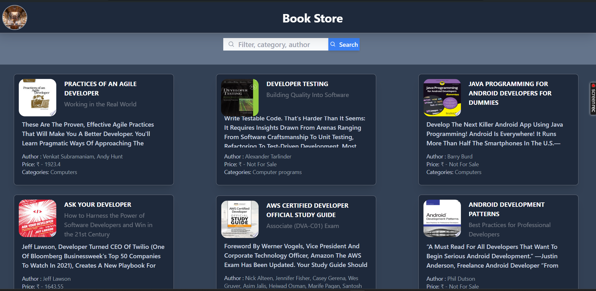
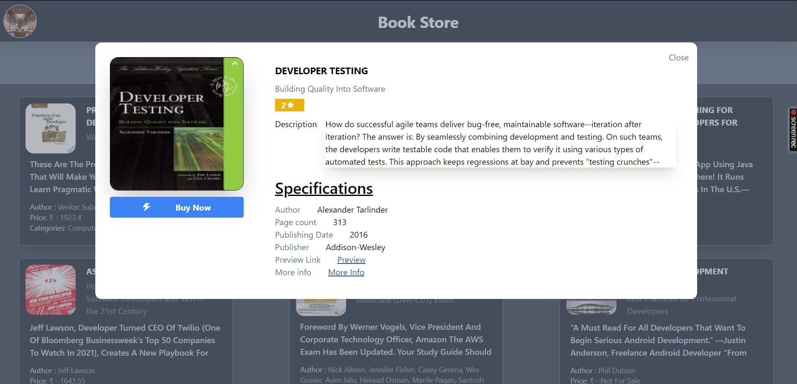
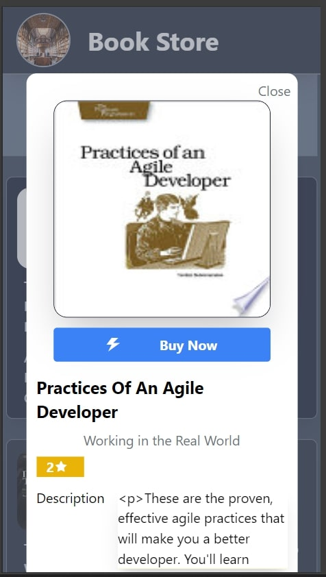
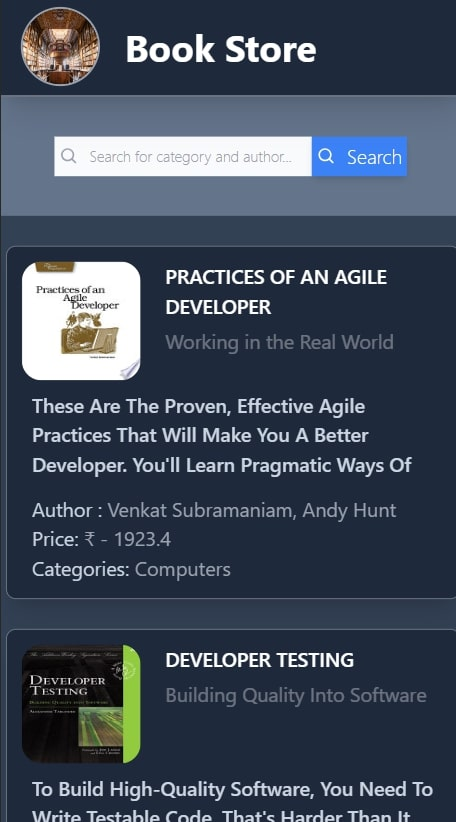

# Getting Started with Create React App

This project was bootstrapped with [Create React App](https://github.com/facebook/create-react-app).
## Deployed URL :https://mybook-web.netlify.app/

## Available Scripts

In the project directory, you can run:

### `npm start`

Runs the app in the development mode.\
Open [http://localhost:3000](http://localhost:3000) to view it in your browser.

The page will reload when you make changes.\
You may also see any lint errors in the console.

## Introduction :
The React, Redux Toolkit, and Tailwind CSS-powered book e-commerce website offers seamless browsing and purchasing experiences. With an extensive collection of titles, intuitive search and filtering options, and responsive design ensure convenience. The website aims to be a trusted destination for book enthusiasts, providing comprehensive features for an enjoyable shopping journey..

## Technologies Used :
- React.js: A JavaScript library for building user interfaces.
- React.js, Redux & RTK: Markup and styling languages for building web pages.
- JavaScript: A programming language for adding interactivity to web applications.
- Tailwind CSS: A CSS framework for creating responsive and mobile-first designs.
- Git: A version control system for tracking changes and collaborating on projects.
- GitHub Pages: A platform for hosting and deploying web applications.
- Netlify- for hosting the project

### Deployment
  Deployed link: https://mybook-web.netlify.app/
### Some Images:
  # For Destop size
  
  

  # For Mobile Screen
  
  
  

  
